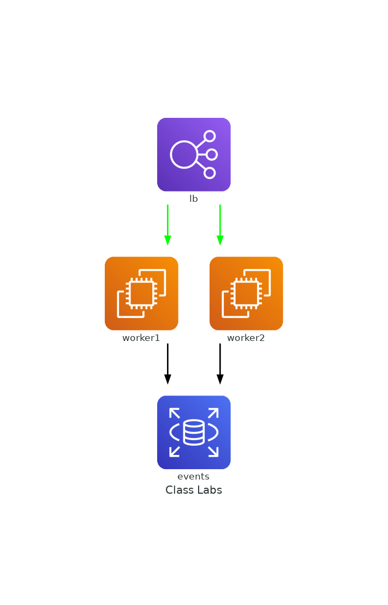

# Diagrams

[Diagrams](https://diagrams.mingrammer.com/) lets you draw the cloud system architecture in Python code.

References:

Documentation - https://diagrams.mingrammer.com/docs/getting-started/installation

## Install dependency

Graphviz

```bash
sudo apt install graphviz
```

Diagrams - inside virtual environment

```bash
pip install diagrams
```

## Tutorials

1. Get familier with the terms

   - Diagrams - Diagram is a primary object representing a diagram.
   - Nodes - Node is a second object representing a node or system component.
   - Cluster - Cluster allows you group (or clustering) the nodes in an isolated group.
   - Edges - Edge is representing an edge between Nodes.

2. Create a python script [arch.py](arch.py)

3. Generate the image

   ```bash
   python arch.py
   ```

   The image gets generated in the current working directory

   <!-- <imag src="class_labs.png" width="300" height="300" /> -->

   

4. You can use [assgn02.py](assgn02.py) as a reference to built your architecture diagram for assignment2. Please modify as per your implementation.
